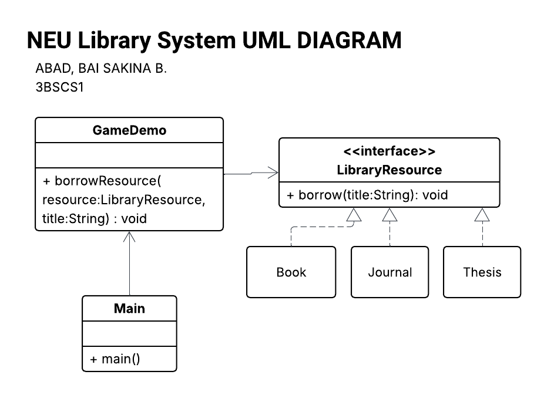

## Lab-Assignment-6-SOLID-with-Design-Pattern
### Problem Statement
The current system implementation for the NEU Library violates the **Dependency Inversion Principle (DIP)**.
The `Student` class is directly dependent on low-level modules (specific resource types like `Book` and `Journal`) through methods like `borrowBook()` and `borrowJournal()`.

This tight coupling makes the system rigid; adding new resources (e.g., Audiobooks, E-Journals) would require modifying the `Student` class, which also violates the **Open/Closed Principle (OCP)**.

## Proposed Solution
To resolve these issues, we introduced an abstraction layer (an interface) between the `Student` and the library resources.
* **Dependency Inversion Principle (DIP):** The `Student` now depends on a `LibraryResource` interface rather than concrete classes.
* **Open/Closed Principle (OCP):** New resource types can be added by implementing the interface without changing existing code.
* **Interface Segregation Principle(ISP):** The interface is kept lean, focusing only on the necessary borrowing logic.

### UML Class Diagram

